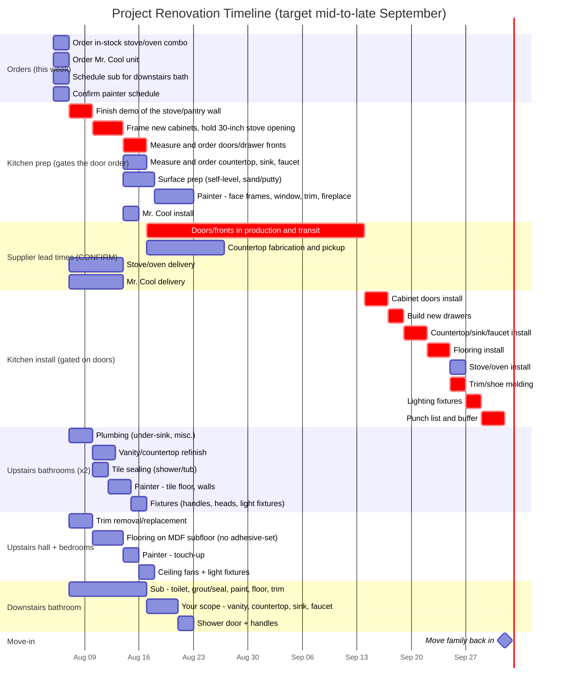

# Project Renovation Timeline

Schedule origin: 2026-08-05. **Computed move-in: 2026-10-02.**

The original target was mid-to-late September. This no longer reaches it, and
the reason is structural rather than a matter of working faster. See
[Why September slipped](#why-september-slipped).

Durations are the operator's numbers and were not changed. Sequencing,
supplier lead times, and the move-in gate were.

## Timeline

Dates below are mermaid's own computed values, read out of the parsed chart,
not estimated by hand. Calendar days, no weekend exclusion.

## Why September slipped

The cabinet doors cannot be ordered until the stove and pantry wall is
demolished and the new cabinets are framed to hold a 30-inch opening for the
stove/oven combo. The doors have to be measured against the face frames that
framing produces, so the order cannot go in on day one.

That pushes the single longest item in the build, the door lead time, twelve
days later than the previous version assumed:

| | Previous version | With the order gated on framing |
| --- | --- | --- |
| Door order placed | 2026-08-08 | 2026-08-17 |
| Doors arrive (4-week assumption) | 2026-09-05 | 2026-09-14 |
| Move-in | 2026-09-23 | **2026-10-02** |

Nothing was made slower. The work simply cannot start where it was drawn as
starting.

## The one number that decides the date

Cabinet door lead time. The 28-day (4-week) figure is an **assumption, not a
quote**. The slip is 1:1: every day of lead time is a day of move-in.

| Door lead time | Doors arrive | Move-in | September? |
| --- | --- | --- | --- |
| 2 weeks | 2026-08-31 | 2026-09-18 | makes it |
| 3 weeks | 2026-09-07 | 2026-09-25 | makes it |
| **4 weeks (assumed)** | **2026-09-14** | **2026-10-02** | **misses by 2 days** |
| 5 weeks | 2026-09-21 | 2026-10-09 | misses |
| 6 weeks | 2026-09-28 | 2026-10-16 | misses |
| 8 weeks | 2026-10-12 | 2026-10-30 | misses |
| 10 weeks | 2026-10-26 | 2026-11-13 | misses |

**September now needs a 3-week door lead time or better.** In the previous
version the cutoff was 5 weeks. Gating the order on framing consumed two weeks
of that margin.

## What would pull it back

Two levers, and only two, because the critical path runs through a single
chain. Both move the date 1:1.

1. **Get to the door order sooner.** Twelve days currently separate today from
   the order going in: 2 days to schedule the sub, 3 to demo, 4 to frame, 3 to
   measure and order. Any day saved anywhere in that run is a day off move-in.
   The measure-and-order step at 3 days is the softest of them; if the supplier
   can take the order the day framing finishes, that alone is 2 days.
2. **Shorten the door lead time.** Ask what a rush costs, and ask whether a
   partial shipment of the door fronts alone, ahead of the drawer fronts, would
   let the install start earlier.

The 3-day punch list and buffer before move-in is the only slack deliberately
built in. Cutting it buys 3 days and gives up the cushion.

## Critical path

schedule sub -> demo -> frame the 30-inch opening -> measure and order doors ->
**doors in production** -> doors install -> build drawers -> countertop ->
flooring -> trim -> lighting -> punch list -> move in.

Everything else has more than a month of float. Both upstairs bathrooms finish
2026-08-17, the hall and bedrooms 2026-08-18, the downstairs bathroom
2026-08-23. If labor is short in September it belongs in the kitchen; if it is
short in August, the kitchen prep run is the only thing that matters, because
that is what gates the order.

## Open questions for the operator

- **What is the real quoted lead time on the doors and drawer fronts?**
  September survives at 3 weeks and dies at 4. Nothing else on this page is
  worth acting on until that is a number from a supplier.
- **Get the stove's actual dimensions before framing, not the unit itself.**
  Framing runs 2026-08-10 to 08-14 and the stove is not scheduled to arrive
  until 08-14. Framing a 30-inch opening against a spec sheet is fine; framing
  it against an assumption is how a range ends up not fitting. The spec sheet
  is available the day it is ordered.
- **Can the countertop be templated off the new face frames as soon as they are
  framed?** The chart assumes the countertop order also waits for framing, which
  costs nothing here because it carries over three weeks of slack. If it turns
  out it could have been ordered earlier, the date does not change.
- **Does the countertop fabricator need the cabinets fully set before
  templating?** The chart assumes yes, so the install waits on the drawers.
- **Calendar days are used throughout, weekends included.** If the sub and the
  painter work weekdays only, add `excludes weekends` and every date stretches
  by roughly 40 percent, which would put move-in in November.

## What was wrong with the first pass

The original chart did not render at all, and its move-in milestone landed
2026-08-18, weeks earlier than its own stated target.

**Syntax (chart would not display):**

1. `Call sub re: downstairs bath scheduling` - a task whose text begins with
   `Call` collides with mermaid's `call` callback keyword. Hard parse error.
2. Five task names contained a colon (`Painter:`, `Sub:`, `Your scope:`).
   These pass `mermaid.parse()` but produce tasks with no start time, so the
   chart throws while compiling and never draws. Colons are now hyphens.

**Schedule logic:**

3. **No lead times existed.** Every install was wired `after <order task>`,
   meaning it started the day the order was *placed*. Doors were labeled the
   long pole but modeled as a 14-day bar starting 2026-08-08.
4. **Installs preceded their prerequisites.** Countertop install ran
   2026-08-08 to 08-11, before demo finished, before surface prep, and before
   any cabinet doors existed. Stove install finished 08-09, five days before
   the stove space rough-in was done.
5. **The move-in milestone was gated on one task.** It fired `after k12`
   (kitchen lighting) only, triggering while six tasks were still open.
6. **The door order was drawn as the first task of the build.** It cannot be:
   the doors are measured against face frames that do not exist until demo and
   framing are complete. This is what moved the date out of September.
