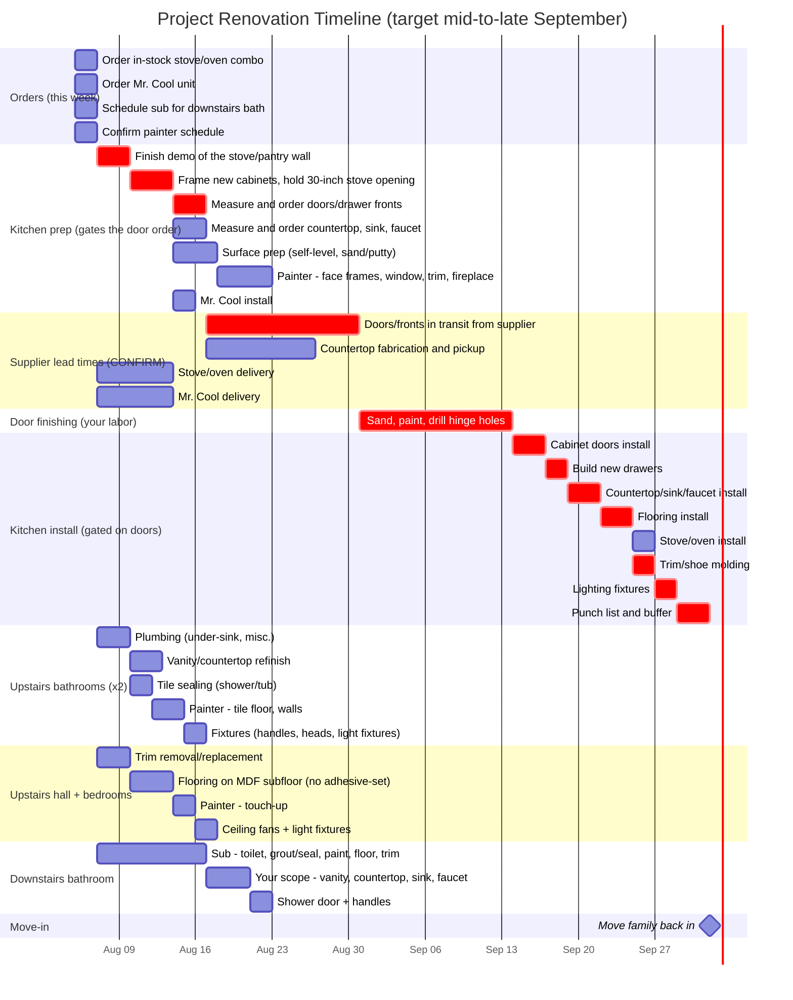

# Project Renovation Timeline

Schedule origin: 2026-08-05. **Computed move-in: 2026-10-02** at the operator's
worst case, **2026-09-25** at the operator's best case.

The target was mid-to-late September. Whether it holds now depends almost
entirely on one thing, and it is not the supplier. See
[Where September is won or lost](#where-september-is-won-or-lost).

Durations are the operator's numbers. Sequencing, lead times, and the move-in
gate were corrected.

## Timeline

Dates below are mermaid's own computed values, read out of the parsed chart,
not estimated by hand. Calendar days, no weekend exclusion.

## Where September is won or lost

The four weeks between placing the door order and hanging doors is not four
weeks of supplier time. It is two different things with two different
characters:

| Phase | Length | Whose time | Compressible? |
| --- | --- | --- | --- |
| Doors in transit from supplier | ~2 weeks | theirs | only by paying for a rush |
| Sand, paint, drill hinge holes | 1 to 2 weeks | **yours** | **yes** |

The supplier half is fixed. The finishing half is labor, and labor is the part
you control. That is where the date actually lives:

| Transit | Your finishing | Doors ready to hang | Move-in | September? |
| --- | --- | --- | --- | --- |
| 2 weeks | 3 days | 2026-09-03 | 2026-09-21 | yes, with 9 days to spare |
| 2 weeks | 1 week | 2026-09-07 | 2026-09-25 | yes |
| 2 weeks | 10 days | 2026-09-10 | 2026-09-28 | yes, barely |
| 2 weeks | **2 weeks** | 2026-09-14 | **2026-10-02** | **no, by 2 days** |
| 3 weeks | 1 week | 2026-09-14 | 2026-10-02 | no |
| 3 weeks | 2 weeks | 2026-09-21 | 2026-10-09 | no |

Your own range, one to two weeks, straddles the line exactly. One week and
September holds with a week to spare. Two weeks and it misses by two days.

## The highest-leverage question to ask the supplier

**Can they bore the hinge holes and factory-finish the doors?**

Most door suppliers will do both for an upcharge, and it is the single change
that moves this schedule most. Boring hinge holes and painting are the bulk of
the one-to-two weeks. If the doors arrive bored and finished, that phase
collapses to a few days of touch-up and hanging hardware:

- Doors ready to hang 2026-09-03 instead of 09-14
- **Move-in 2026-09-21**, nine days inside the target

It also removes the risk of a two-week task run by one person becoming a
three-week task, which is the most likely way this schedule slips further.
Worth asking what it costs before assuming it is not worth it.

## The second lever, and why it is smaller

Getting to the order sooner. Twelve days separate today from the order going
in: 2 to schedule the sub, 3 to demo, 4 to frame, 3 to measure and order. Any
day saved there is a day off move-in. The measure-and-order step at 3 days is
the softest; if the supplier takes the order the day framing finishes, that is
2 days.

Worth doing, but it is days where the finishing question is worth over a week.

## One thing working in your favor

Every other work stream finishes by 2026-08-23: both upstairs bathrooms on the
17th, the hall and bedrooms on the 18th, the downstairs bathroom on the 23rd.
The doors do not land until 08-31.

So nothing competes with the door finishing. It gets your undivided attention
for as long as it takes, which makes the one-week end of your estimate
realistic rather than optimistic, and means bringing in a second pair of hands
would translate directly into days saved.

## Critical path

schedule sub -> demo -> frame the 30-inch opening -> measure and order doors ->
doors in transit -> **sand, paint, drill hinge holes** -> doors install ->
build drawers -> countertop -> flooring -> trim -> lighting -> punch list ->
move in.

The bolded step is the only one on this path that is yours to compress without
paying someone.

## Open questions for the operator

- **Can the supplier bore hinge holes and factory-finish?** The biggest single
  question on the schedule. See above.
- **Get the stove's actual dimensions before framing, not the unit itself.**
  Framing runs 2026-08-10 to 08-14 and the stove is not due until 08-14.
  Framing a 30-inch opening against a spec sheet is fine; framing it against an
  assumption is how a range ends up not fitting. The spec sheet is available
  the day it is ordered.
- **Do the doors get painted with the same batch as the face frames?** The
  painter does the face frames 08-18 to 08-23; the doors are not in hand until
  08-31. Same product and colour code is usually enough, but it is worth
  deciding deliberately rather than discovering a sheen difference at install.
- **Is the door finishing your work or the painter's?** The chart assumes
  yours. If the painter could take it, that changes who the bottleneck is.
- **Does the countertop fabricator need the cabinets fully set before
  templating?** The chart assumes yes, so the install waits on the drawers.
- **Calendar days are used throughout, weekends included.** If the sub and the
  painter work weekdays only, add `excludes weekends` and every date stretches
  by roughly 40 percent.
