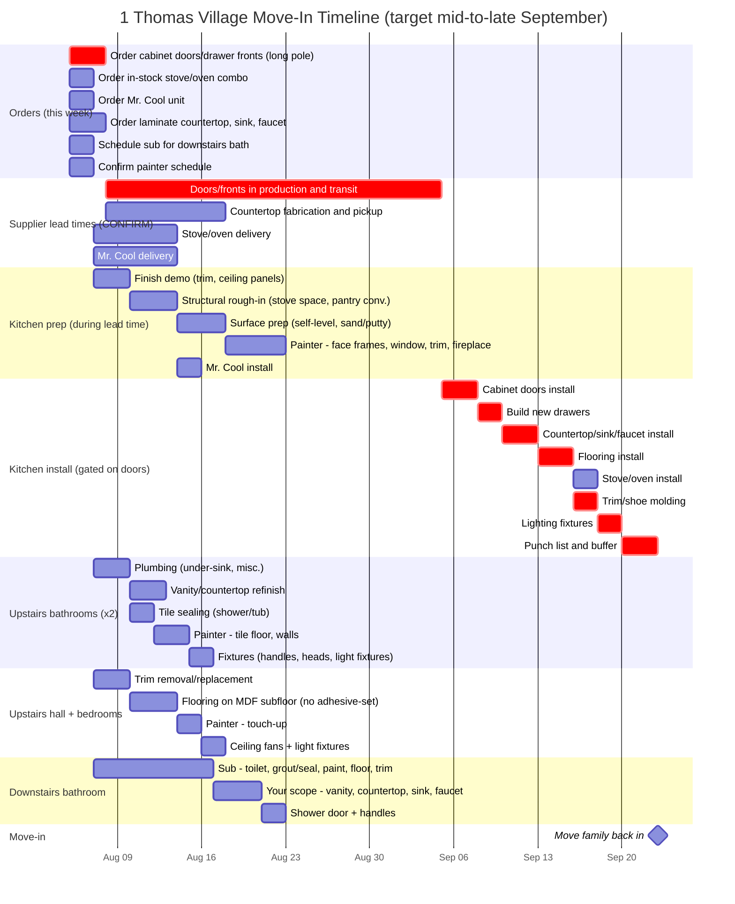

# 1 Thomas Village - Move-In Timeline

Target: mid-to-late September 2026. Schedule origin: 2026-08-05.

Durations below are the operator's numbers and were not changed. What changed
is sequencing, supplier lead times, and the move-in gate. See
[What was wrong with the first pass](#what-was-wrong-with-the-first-pass).

## Timeline

**Computed move-in: 2026-09-23.** Dates below are mermaid's own computed
values, read out of the parsed chart, not estimated by hand. Calendar days,
no weekend exclusion.

## The one number that decides the date

Everything hinges on cabinet door lead time. The 28-day (4-week) figure in
the chart is an **assumption, not a quote**. Confirm it with the supplier
before treating any of this as a plan. The slip is 1:1 - every day of door
lead time is a day of move-in.

| Door lead time | Doors arrive | Move-in |
| --- | --- | --- |
| 2 weeks | 2026-08-22 | 2026-09-10 |
| 3 weeks | 2026-08-29 | 2026-09-16 |
| **4 weeks (assumed)** | **2026-09-05** | **2026-09-23** |
| 5 weeks | 2026-09-12 | 2026-09-30 |
| 6 weeks | 2026-09-19 | 2026-10-07 |
| 8 weeks | 2026-10-03 | 2026-10-21 |
| 10 weeks | 2026-10-17 | 2026-11-04 |

Anything past a 5-week door lead time misses September. The other three lead
times (countertop 10d, stove 7d, Mr. Cool 7d) have slack and are not on the
critical path; they are placeholders too, but getting them wrong costs
nothing until they exceed roughly four weeks.

## Critical path

order1 -> lead1 (doors) -> k5 install -> k6 drawers -> k7 countertop ->
k9 flooring -> k10 trim -> k12 lighting -> k13 punch list -> move-in.

Nothing else comes close. Both upstairs bathrooms finish 2026-08-17, the hall
and bedrooms 2026-08-18, and the downstairs bathroom 2026-08-23 - all more
than a month of float. If effort is short, it belongs on the kitchen.

## What was wrong with the first pass

The original chart did not render at all, and its move-in milestone landed
2026-08-18, about five weeks earlier than its own stated target.

**Syntax (chart would not display):**

1. `Call sub re: downstairs bath scheduling` - a task whose text begins with
   `Call` collides with mermaid's `call` callback keyword. Hard parse error.
2. Five task names contained a colon (`Painter:`, `Sub:`, `Your scope:`).
   These pass `mermaid.parse()` but produce tasks with no start time, so the
   chart throws while compiling and never draws. Colons are now hyphens.

**Schedule logic:**

3. **No lead times existed.** Every install was wired `after <order task>`,
   meaning it started the day the order was *placed*. Doors were labeled the
   long pole but modeled as a 14-day bar starting 2026-08-08. That single
   modeling choice is what collapsed the whole schedule into August.
4. **Installs preceded their prerequisites.** Countertop install ran
   2026-08-08 to 08-11, before demo finished (08-10), before surface prep,
   and before any cabinet doors existed. Stove install finished 08-09, five
   days before the stove space rough-in was done. Flooring finished 08-14,
   nine days before the painter left.
5. **The move-in milestone was gated on one task.** It fired `after k12`
   (kitchen lighting) only, so it triggered 2026-08-18 while six tasks were
   still open, including kitchen drawers (to 08-24) and the downstairs
   bathroom shower door (to 08-23). It now waits on all four work streams.

**Added:** a 3-day punch list and buffer before move-in. Adjust or delete if
you would rather carry the risk.

## Open questions for the operator

- Actual quoted lead time on the doors and drawer fronts. Everything else is
  noise until this is a real number.
- Does the countertop need the cabinets in place for templating? The chart
  assumes yes (k7 waits on k6), which costs about three days. If the fabricator
  templates off the existing face frames, that can start earlier.
- Flooring is scheduled after the countertop and before the stove, so the
  range sits on finished floor. Confirm that matches how you want it done.
- Calendar days are used throughout, weekends included. If the sub and painter
  work weekdays only, add `excludes weekends` to the chart and the dates will
  stretch by roughly 40 percent.
